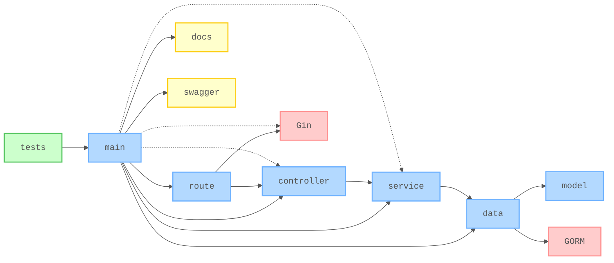
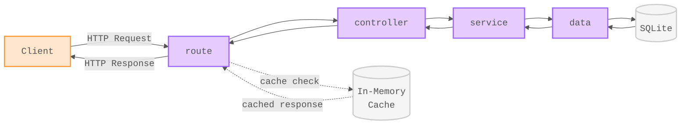

# 🧪 RESTful API with Go and Gin

[](https://github.com/nanotaboada/go-samples-gin-restful/actions/workflows/go-ci.yml)
[](https://github.com/nanotaboada/go-samples-gin-restful/actions/workflows/go-cd.yml)
[](https://sonarcloud.io/summary/new_code?id=nanotaboada_go-samples-gin-restful)
[](https://codecov.io/gh/nanotaboada/go-samples-gin-restful)
[](https://goreportcard.com/report/github.com/nanotaboada/go-samples-gin-restful)
[](https://www.codefactor.io/repository/github/nanotaboada/go-samples-gin-restful)
[](https://opensource.org/licenses/MIT)

Proof of Concept for a RESTful API built with [Go](https://github.com/golang/go) and [Gin](https://github.com/gin-gonic/gin). Manage football player data with SQLite, GORM, Swagger documentation, and in-memory caching.

## Table of Contents

- [Features](#features)
- [Tech Stack](#tech-stack)
- [Project Structure](#project-structure)
- [Architecture](#architecture)
- [API Reference](#api-reference)
- [Prerequisites](#prerequisites)
- [Quick Start](#quick-start)
- [Testing](#testing)
- [Docker](#docker)
- [Releases](#releases)
- [Environment Variables](#environment-variables)
- [Command Summary](#command-summary)
- [Contributing](#contributing)
- [Legal](#legal)

## Features

- 🏗️ **Idiomatic Go patterns** - Clean architecture with middleware, dependency injection, and concurrency safety
- 📚 **Interactive API exploration** - Auto-generated Swagger docs with Postman collection and health monitoring
- ⚡ **Performance optimizations** - In-memory caching, connection pooling, and efficient GORM queries
- 🧪 **Comprehensive integration tests** - Full endpoint coverage with automated reporting to Codecov and SonarCloud
- 📖 **Token-efficient documentation** - AGENTS.md + auto-loaded Copilot instructions for AI-assisted development
- 🐳 **Full containerization** - Optimized Docker builds with Docker Compose orchestration
- 🔄 **Complete CI/CD pipeline** - Automated testing with race detection, Docker publishing, and GitHub releases
- 🎖️ **Player-themed semantic versioning** - Memorable, alphabetical release names honoring football legends

## Tech Stack

| Category | Technology |
| -------- | ---------- |
| **Language** | [Go 1.25](https://github.com/golang/go) |
| **Web Framework** | [Gin](https://github.com/gin-gonic/gin) |
| **ORM** | [GORM](https://github.com/go-gorm/gorm) |
| **Database** | [SQLite](https://github.com/sqlite/sqlite) |
| **Caching** | [gin-contrib/cache](https://github.com/gin-contrib/cache) |
| **API Documentation** | [Swagger/OpenAPI](https://github.com/swaggo/swag) |
| **Testing** | [testify](https://github.com/stretchr/testify) |
| **Containerization** | [Docker](https://github.com/docker) & [Docker Compose](https://github.com/docker/compose) |

## Project Structure

```tree
/
├── main.go                 # Entry point: DB connection, route setup, server start
├── controller/             # HTTP handlers (request/response logic)
│   └── player_controller.go
├── service/                # Business logic (ORM interactions)
│   └── player_service.go
├── route/                  # Route configuration and middleware
│   ├── player_route.go     # Route setup with caching middleware
│   └── path.go             # Path constants
├── model/                  # Data structures
│   └── player_model.go
├── data/                   # Database connection
│   └── player_data.go
├── swagger/                # Swagger configuration
│   └── swagger.go
├── docs/                   # Auto-generated Swagger docs (DO NOT EDIT)
│   ├── docs.go
│   ├── swagger.json
│   └── swagger.yaml
├── tests/                  # Integration tests
│   ├── main_test.go
│   ├── player_fake.go
│   └── players.json
├── storage/                # SQLite database file (pre-seeded)
├── scripts/                # Container entrypoint & healthcheck
└── .github/workflows/      # CI/CD pipelines
```

## Architecture



**Arrow Semantics:**

- **Solid arrows** represent compile-time module dependencies (imports). For example, `controller → service` means the controller package imports and uses the service package.
- **Dotted arrows** represent runtime composition. The `main` package creates instances (database connection, service, controller, Gin router) and wires them together at startup.

**Composition Root Pattern:** The `main` package acts as the composition root, creating all dependencies and the Gin router instance. It registers player routes through the `route` package and adds Swagger/health routes directly. This pattern enables dependency injection, improves testability, and maintains clear separation of concerns.

**Layered Architecture:** HTTP requests flow through distinct layers: `route` → `controller` → `service` → `data` → `model`. Each layer has a specific responsibility - routes handle HTTP mapping, controllers manage request/response, services contain business logic, data handles persistence, and models define data structures.

**Color Coding:** Core packages (blue) implement the application logic, supporting features (yellow) provide documentation and utilities, external dependencies (red) are third-party frameworks and ORMs, and tests (green) ensure code quality.

## API Reference

Interactive API documentation is available via Swagger UI at `http://localhost:9000/swagger/index.html` when the server is running.

> 💡 The Swagger documentation is automatically generated from code annotations using [swaggo/swag](https://github.com/swaggo/swag). To regenerate after making changes, run `swag init`.

### Request Flow



HTTP request-response cycle: Client → Route → Controller → Service → Data → Database. Responses flow back through the same layers. GET requests are cached for 1 hour to improve performance.

**Quick Reference:**

- `GET /players` - List all players
- `GET /players/:id` - Get player by ID
- `GET /players/squadnumber/:squadnumber` - Get player by squad number
- `POST /players` - Create new player
- `PUT /players/:id` - Update player
- `DELETE /players/:id` - Remove player
- `GET /health` - Health check

For complete endpoint documentation with request/response schemas, explore the [interactive Swagger UI](http://localhost:9000/swagger/index.html). You can also access the OpenAPI JSON specification at `http://localhost:9000/swagger.json`.

### Postman Collection

A pre-configured Postman collection is available at [`postman-collections/go-samples-gin-restful.postman_collection.json`](postman-collections/go-samples-gin-restful.postman_collection.json).

## Prerequisites

Before you begin, ensure you have the following installed:

- **Go 1.25 or higher**
- **Docker & Docker Compose** (optional, for containerized deployment)

## Quick Start

### Clone the repository

```bash
git clone https://github.com/nanotaboada/go-samples-gin-restful.git
cd go-samples-gin-restful
```

### Install dependencies

```bash
go mod download
```

### Start the development server

```bash
go run .
```

The server will start on `http://localhost:9000`.

### Access the application

- **API:** `http://localhost:9000`
- **Swagger Documentation:** `http://localhost:9000/swagger/index.html`
- **Health Check:** `http://localhost:9000/health`

## Testing

Run the test suite with coverage:

```bash
# Run all tests
go test ./...

# Run tests with coverage
go test -v ./... -coverprofile=coverage.out

# Run tests with detailed coverage for specific packages
go test -v ./... \
  -coverpkg=github.com/nanotaboada/go-samples-gin-restful/service,github.com/nanotaboada/go-samples-gin-restful/controller,github.com/nanotaboada/go-samples-gin-restful/route \
  -covermode=atomic \
  -coverprofile=coverage.out

# View coverage report
go tool cover -html=coverage.out
```

Tests are located in the `tests/` directory and use testify for integration testing. Coverage reports are generated for controllers, services, and routes only.

**Coverage targets:** 80% minimum for service, controller, and route packages.

## Docker

This project includes full Docker support with multi-stage builds and Docker Compose for easy deployment.

### Build the Docker image

```bash
docker compose build
```

### Start the application

```bash
docker compose up
```

> 💡 On first run, the container copies a pre-seeded SQLite database into a persistent volume. On subsequent runs, that volume is reused and the data is preserved.

### Stop the application

```bash
docker compose down
```

### Reset the database

To remove the volume and reinitialize the database from the built-in seed file:

```bash
docker compose down -v
```

The containerized application runs on port 9000 and includes health checks that monitor the `/health` endpoint every 30 seconds.

## Releases

This project uses famous football players as release codenames 🎖️, inspired by Ubuntu, Android, and macOS naming conventions.

### Release Naming Convention

Releases follow the pattern: `v{SEMVER}-{PLAYER}` (e.g., `v1.0.0-ademir`)

- **Semantic Version**: Standard versioning (MAJOR.MINOR.PATCH)
- **Player Name**: Alphabetically ordered codename from the [famous player list](CHANGELOG.md#famous-football-player-names-️)

### Create a Release

To create a new release, follow this workflow:

#### 1. Update CHANGELOG.md

First, document your changes in [CHANGELOG.md](CHANGELOG.md):

```bash
# Move items from [Unreleased] to new release section
# Example: [1.0.0 - Ademir] - 2026-02-15
git add CHANGELOG.md
git commit -m "docs: prepare changelog for v1.0.0-ademir release"
git push
```

#### 2. Create and Push Tag

Then create and push the version tag:

```bash
git tag -a v1.0.0-ademir -m "Release 1.0.0 - Ademir"
git push origin v1.0.0-ademir
```

#### 3. Automated CD Workflow

This triggers the CD workflow which automatically:

1. Validates the player name
2. Builds and tests the project with race detector
3. Publishes Docker images to GitHub Container Registry with three tags
4. Creates a GitHub Release with auto-generated changelog from commits

> 💡 Always update CHANGELOG.md before creating the tag. See [CHANGELOG.md](CHANGELOG.md#how-to-release) for detailed release instructions.

### Pull Docker Images

Each release publishes multiple tags for flexibility:

```bash
# By semantic version (recommended for production)
docker pull ghcr.io/nanotaboada/go-samples-gin-restful:1.0.0

# By player name (memorable alternative)
docker pull ghcr.io/nanotaboada/go-samples-gin-restful:ademir

# Latest release
docker pull ghcr.io/nanotaboada/go-samples-gin-restful:latest
```

> 💡 See [CHANGELOG.md](CHANGELOG.md) for the complete player list (A-Z) and release history.

## Environment Variables

The application can be configured using the following environment variables (declared in [`compose.yaml`](https://github.com/nanotaboada/go-samples-gin-restful/blob/master/compose.yaml)):

```bash
# Database storage path (default: ./storage/players-sqlite3.db)
# In Docker: /storage/players-sqlite3.db
STORAGE_PATH=./storage/players-sqlite3.db

# Gin framework mode: debug, release, or test (default: debug)
# In Docker: release
GIN_MODE=release
```

## Command Summary

| Command | Description |
| ------- | ----------- |
| `go run .` | Start development server |
| `go build` | Build the application |
| `go test ./...` | Run all tests |
| `go test -v ./... -coverpkg=github.com/nanotaboada/go-samples-gin-restful/service,github.com/nanotaboada/go-samples-gin-restful/controller,github.com/nanotaboada/go-samples-gin-restful/route -covermode=atomic -coverprofile=coverage.out` | Run tests with coverage |
| `go tool cover -html=coverage.out` | View coverage report |
| `go fmt ./...` | Format code |
| `go mod tidy` | Clean up dependencies |
| `swag init` | Regenerate Swagger documentation |
| `docker compose build` | Build Docker image |
| `docker compose up` | Start Docker container |
| `docker compose down` | Stop Docker container |
| `docker compose down -v` | Stop and remove Docker volume |

## Contributing

Contributions are welcome! Please read [CONTRIBUTING.md](CONTRIBUTING.md) for details on the code of conduct and the process for submitting pull requests.

**Key guidelines:**

- Follow [Conventional Commits](https://www.conventionalcommits.org/) for commit messages
- Ensure all tests pass (`go test ./...`)
- Run `go fmt` before committing
- Keep changes small and focused

## Legal

This project is provided for educational and demonstration purposes and may be used in production environments at your discretion. All referenced trademarks, service marks, product names, company names, and logos are the property of their respective owners and are used solely for identification or illustrative purposes.
