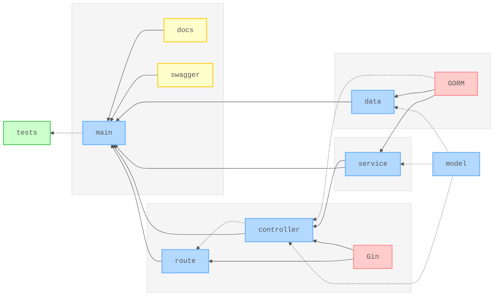

# 🧪 RESTful API with Go and Gin

[](https://github.com/nanotaboada/go-samples-gin-restful/actions/workflows/go-ci.yml)
[](https://github.com/nanotaboada/go-samples-gin-restful/actions/workflows/go-cd.yml)
[](https://github.com/nanotaboada/go-samples-gin-restful/actions/workflows/codeql.yml)
[](https://sonarcloud.io/summary/new_code?id=nanotaboada_go-samples-gin-restful)
[](https://codecov.io/gh/nanotaboada/go-samples-gin-restful)
[](https://goreportcard.com/report/github.com/nanotaboada/go-samples-gin-restful)
[](https://www.codefactor.io/repository/github/nanotaboada/go-samples-gin-restful)
[](https://opensource.org/licenses/MIT)


Proof of Concept for a RESTful Web Service built with **Gin** and **Go 1.25**. This project demonstrates best practices for building a layered, testable, and maintainable API implementing CRUD operations for a Players resource (Argentina 2022 FIFA World Cup squad).

## Features

- 🏗️ **Layered Architecture** - Idiomatic Go with interface-based contracts and constructor injection
- 📚 **Interactive Documentation** - Auto-generated Swagger UI with VS Code and JetBrains REST Client support
- ⚡ **Performance Caching** - In-memory response caching via gin-contrib/cache with GORM
- 🚦 **Comprehensive Testing** - Full endpoint coverage with testify, race detector, and automated reporting to Codecov
- 🐳 **Containerized Deployment** - Multi-stage Docker builds with migration-based database initialization
- 🔄 **Automated Pipeline** - Continuous integration with race detector, Docker publishing, and GitHub releases

## Tech Stack

| Category | Technology |
| -------- | ---------- |
| **Language** | [Go 1.25](https://github.com/golang/go) |
| **Web Framework** | [Gin](https://github.com/gin-gonic/gin) |
| **ORM** | [GORM](https://github.com/go-gorm/gorm) |
| **Database** | [SQLite](https://github.com/sqlite/sqlite) |
| **Migrations** | [goose](https://github.com/pressly/goose) |
| **Caching** | [gin-contrib/cache](https://github.com/gin-contrib/cache) |
| **API Documentation** | [Swagger/OpenAPI](https://github.com/swaggo/swag) |
| **Testing** | [testify](https://github.com/stretchr/testify) |
| **Containerization** | [Docker](https://github.com/docker) & [Docker Compose](https://github.com/docker/compose) |

## Architecture

Layered architecture with dependency injection via constructors and interface-based contracts.


```mermaid
%%{init: {
  "theme": "default",
  "themeVariables": {
    "fontFamily": "Fira Code, Consolas, monospace",
    "textColor": "#555",
    "lineColor": "#555",
    "clusterBkg": "#f5f5f5",
    "clusterBorder": "#ddd"
  }
}}%%

graph RL

    %% Packages
    tests[tests]

    subgraph Layer 1[" "]
      main[main]
      docs[docs]
      swagger[swagger]
    end

    model[model]

    subgraph Layer 2[" "]
      route[route]
      controller[controller]
      gin[Gin]
    end

    subgraph Layer 3[" "]
      service[service]
    end

    subgraph Layer 4[" "]
      data[data]
      gorm[GORM]
    end

    %% Strong dependencies — functional/behavioral coupling
    controller --> main
    data --> main
    route --> main
    service --> main
    swagger --> main
    docs --> main
    gin --> route
    gin --> controller
    service --> controller
    gorm --> service
    gorm --> data

    %% Soft dependencies — structural/type coupling
    controller -.-> route
    model -.-> controller
    gorm -.-> controller
    model -.-> service
    model -.-> data
    main -.-> tests

    %% Node styling
    classDef core fill:#b3d9ff,stroke:#6db1ff,stroke-width:2px,color:#555,font-family:monospace;
    classDef support fill:#ffffcc,stroke:#fdce15,stroke-width:2px,color:#555,font-family:monospace;
    classDef deps fill:#ffcccc,stroke:#ff8f8f,stroke-width:2px,color:#555,font-family:monospace;
    classDef test fill:#ccffcc,stroke:#53c45e,stroke-width:2px,color:#555,font-family:monospace;

    class main,route,controller,service,data,model core
    class docs,swagger support
    class gin,gorm deps
    class tests test
```

> *Arrows follow the injection direction (A → B means A is injected into B). Solid = runtime dependency, dotted = structural. Blue = core domain, yellow = support, red = third-party, green = tests.*

Significant architectural decisions are documented in [`docs/adr/`](docs/adr/).

## API Reference

Interactive API documentation is available via Swagger UI at `http://localhost:9000/swagger/index.html` when the server is running.

| Method | Endpoint | Description | Status |
| ------ | -------- | ----------- | ------ |
| `GET` | `/players` | List all players | `200 OK` |
| `GET` | `/players/:id` | Get player by ID | `200 OK` |
| `GET` | `/players/squadnumber/:squadnumber` | Get player by squad number | `200 OK` |
| `POST` | `/players` | Create new player | `201 Created` |
| `PUT` | `/players/squadnumber/:squadnumber` | Update player by squad number | `204 No Content` |
| `DELETE` | `/players/squadnumber/:squadnumber` | Remove player by squad number | `204 No Content` |
| `GET` | `/health` | Health check | `200 OK` |

Error codes: `400 Bad Request` (validation failed) · `404 Not Found` (player not found) · `409 Conflict` (duplicate squad number on `POST`)

For complete endpoint documentation with request/response schemas, explore the [interactive Swagger UI](http://localhost:9000/swagger/index.html). You can also access the OpenAPI JSON specification at `http://localhost:9000/swagger.json`.

Alternatively, use [`rest/players.rest`](rest/players.rest) with the [REST Client](https://marketplace.visualstudio.com/items?itemName=humao.rest-client) extension for VS Code, or the built-in HTTP Client in JetBrains IDEs (IntelliJ IDEA, GoLand, WebStorm).

## Prerequisites

Before you begin, ensure you have the following installed:

- **Go 1.25 or higher**
- **Docker & Docker Compose** (optional, for containerized deployment)

## Quick Start

### Clone

```bash
git clone https://github.com/nanotaboada/go-samples-gin-restful.git
cd go-samples-gin-restful
```

### Install

```bash
go mod download
```

### Run

```bash
go run .
```

### Access

Once the application is running, you can access:

- **API Server**: `http://localhost:9000`
- **Swagger UI**: `http://localhost:9000/swagger/index.html`
- **Health Check**: `http://localhost:9000/health`

## Containers

### Build and Start

```bash
docker compose up
```

> 💡 **Note:** On first run, the app applies all goose migrations (schema + seed data) to the persistent volume. On subsequent runs, already-applied migrations are skipped automatically.

### Stop

```bash
docker compose down
```

### Reset Database

To remove the volume and reinitialize the database from migrations:

```bash
docker compose down -v
```

### Pull Docker Images

Each release publishes multiple tags for flexibility:

```bash
# By semantic version (recommended for production)
docker pull ghcr.io/nanotaboada/go-samples-gin-restful:1.0.0

# By player name (memorable alternative)
docker pull ghcr.io/nanotaboada/go-samples-gin-restful:ademir

# Latest release
docker pull ghcr.io/nanotaboada/go-samples-gin-restful:latest
```

## Database Migrations

Schema and seed data are managed with [goose](https://github.com/pressly/goose) and are embedded into the binary. Migrations run automatically on startup. To inspect or manage migrations manually:

```bash
# Check migration status
goose -dir migrations sqlite3 ./storage/players-sqlite3.db status

# Apply all pending migrations
goose -dir migrations sqlite3 ./storage/players-sqlite3.db up

# Roll back the most recent migration
goose -dir migrations sqlite3 ./storage/players-sqlite3.db down
```

## Environment Variables

```bash
# Database storage path (default: ./storage/players-sqlite3.db)
STORAGE_PATH=./storage/players-sqlite3.db

# Gin framework mode: debug, release, or test (default: debug)
GIN_MODE=release
```

## Contributing

Contributions are welcome! Please see [CONTRIBUTING.md](CONTRIBUTING.md) for details on:

- Code of Conduct
- Development workflow and best practices
- Commit message conventions (Conventional Commits)
- Pull request process and requirements

**Key guidelines:**

- Follow [Conventional Commits](https://www.conventionalcommits.org/) for commit messages
- Ensure all tests pass (`go test ./...`)
- Run `go fmt ./...` before committing
- Keep changes small and focused
- Review `.github/copilot-instructions.md` for architectural patterns

**Testing:**

Run the test suite with testify:

```bash
# Run all tests
go test ./...

# Run tests with coverage
go test -v ./... \
  -coverpkg=github.com/nanotaboada/go-samples-gin-restful/service,github.com/nanotaboada/go-samples-gin-restful/controller,github.com/nanotaboada/go-samples-gin-restful/route \
  -covermode=atomic \
  -coverprofile=coverage.out
```

## Command Summary

| Command | Description |
| ------- | ----------- |
| `go run .` | Start development server |
| `go build` | Build the application |
| `go test ./...` | Run all tests |
| `go test -v ./... -covermode=atomic -coverprofile=coverage.out` | Run tests with coverage |
| `go tool cover -html=coverage.out` | View coverage report |
| `go fmt ./...` | Format code |
| `go mod tidy` | Clean up dependencies |
| `golangci-lint run` | Run linter |
| `swag init` | Regenerate Swagger documentation |
| `docker compose build` | Build Docker image |
| `docker compose up` | Start Docker container |
| `docker compose down` | Stop Docker container |
| `docker compose down -v` | Stop and remove Docker volume |
| **AI Commands** | |
| `/pre-commit` | Runs linting, tests, and quality checks before committing |
| `/pre-release` | Runs pre-release validation workflow |

## Legal

This project is provided for educational and demonstration purposes and may be used in production at your own discretion. All trademarks, service marks, product names, company names, and logos referenced herein are the property of their respective owners and are used solely for identification or illustrative purposes.
