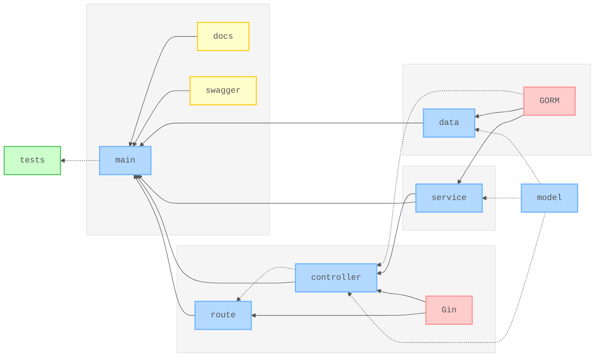

# 🧪 RESTful API with Go and Gin

[](https://github.com/nanotaboada/go-samples-gin-restful/actions/workflows/go-ci.yml)
[](https://github.com/nanotaboada/go-samples-gin-restful/actions/workflows/go-cd.yml)
[](https://github.com/nanotaboada/go-samples-gin-restful/actions/workflows/codeql.yml)
[](https://sonarcloud.io/summary/new_code?id=nanotaboada_go-samples-gin-restful)
[](https://codecov.io/gh/nanotaboada/go-samples-gin-restful)
[](https://goreportcard.com/report/github.com/nanotaboada/go-samples-gin-restful)
[](https://www.codefactor.io/repository/github/nanotaboada/go-samples-gin-restful)
[](https://opensource.org/licenses/MIT)


Proof of Concept for a RESTful API built with [Go](https://github.com/golang/go) and [Gin](https://github.com/gin-gonic/gin). Manage football player data with SQLite, GORM, Swagger documentation, and in-memory caching.

## Table of Contents

- [Features](#features)
- [Tech Stack](#tech-stack)
- [Project Structure](#project-structure)
- [Architecture](#architecture)
- [API Reference](#api-reference)
- [Prerequisites](#prerequisites)
- [Quick Start](#quick-start)
- [Testing](#testing)
- [Docker](#docker)
- [Releases](#releases)
- [Environment Variables](#environment-variables)
- [Command Summary](#command-summary)
- [Contributing](#contributing)
- [Legal](#legal)

## Features

- 🏗️ **Idiomatic Go patterns** - Clean architecture with middleware, dependency injection, and concurrency safety
- 📚 **Interactive API exploration** - Auto-generated Swagger docs with `.rest` file, REST Client integration, and health monitoring
- ⚡ **Performance optimizations** - In-memory caching, connection pooling, and efficient GORM queries
- 🧪 **Comprehensive integration tests** - Full endpoint coverage with automated reporting to Codecov and SonarCloud
- 📖 **Token-efficient documentation** - Auto-loaded Copilot instructions for AI-assisted development
- 🐳 **Full containerization** - Optimized Docker builds with Docker Compose orchestration
- 🔄 **Complete CI/CD pipeline** - Automated testing with race detection, Docker publishing, and GitHub releases
- 🎖️ **Player-themed semantic versioning** - Memorable, alphabetical release names honoring football legends

## Tech Stack

| Category | Technology |
| -------- | ---------- |
| **Language** | [Go 1.25](https://github.com/golang/go) |
| **Web Framework** | [Gin](https://github.com/gin-gonic/gin) |
| **ORM** | [GORM](https://github.com/go-gorm/gorm) |
| **Database** | [SQLite](https://github.com/sqlite/sqlite) |
| **Caching** | [gin-contrib/cache](https://github.com/gin-contrib/cache) |
| **API Documentation** | [Swagger/OpenAPI](https://github.com/swaggo/swag) |
| **Testing** | [testify](https://github.com/stretchr/testify) |
| **Containerization** | [Docker](https://github.com/docker) & [Docker Compose](https://github.com/docker/compose) |

## Project Structure

```tree
/
├── main.go                 # Entry point: DB connection, route setup, server start
├── controller/             # HTTP handlers (request/response logic)
│   └── player_controller.go
├── service/                # Business logic (ORM interactions)
│   └── player_service.go
├── route/                  # Route configuration and middleware
│   ├── player_route.go     # Route setup with caching middleware
│   └── path.go             # Path constants
├── model/                  # Data structures
│   └── player_model.go
├── data/                   # Database connection
│   └── player_data.go
├── swagger/                # Swagger configuration
│   └── swagger.go
├── docs/                   # Auto-generated Swagger docs (DO NOT EDIT)
│   ├── docs.go
│   ├── swagger.json
│   └── swagger.yaml
├── tests/                  # Integration tests
│   ├── main_test.go
│   ├── player_fake.go
│   └── players.json
├── rest/                   # HTTP request files
│   └── players.rest        # CRUD requests (REST Client / JetBrains HTTP Client)
├── storage/                # SQLite database file (pre-seeded)
├── scripts/                # Container entrypoint & healthcheck
└── .github/workflows/      # CI/CD pipelines
```

## Architecture

Layered architecture with dependency injection via constructors and interface-based contracts.


```mermaid
%%{init: {
  "theme": "default",
  "themeVariables": {
    "fontFamily": "Fira Code, Consolas, monospace",
    "textColor": "#555",
    "lineColor": "#555",
    "clusterBkg": "#f5f5f5",
    "clusterBorder": "#ddd"
  }
}}%%

graph RL

    %% Packages
    tests[tests]

    subgraph Layer 1[" "]
      main[main]
      docs[docs]
      swagger[swagger]
    end

    model[model]

    subgraph Layer 2[" "]
      route[route]
      controller[controller]
      gin[Gin]
    end

    subgraph Layer 3[" "]
      service[service]
    end

    subgraph Layer 4[" "]
      data[data]
      gorm[GORM]
    end

    %% Strong dependencies — functional/behavioral coupling
    controller --> main
    data --> main
    route --> main
    service --> main
    swagger --> main
    docs --> main
    gin --> route
    gin --> controller
    service --> controller
    gorm --> service
    gorm --> data

    %% Soft dependencies — structural/type coupling
    controller -.-> route
    model -.-> controller
    gorm -.-> controller
    model -.-> service
    model -.-> data
    main -.-> tests

    %% Node styling
    classDef core fill:#b3d9ff,stroke:#6db1ff,stroke-width:2px,color:#555,font-family:monospace;
    classDef support fill:#ffffcc,stroke:#fdce15,stroke-width:2px,color:#555,font-family:monospace;
    classDef deps fill:#ffcccc,stroke:#ff8f8f,stroke-width:2px,color:#555,font-family:monospace;
    classDef test fill:#ccffcc,stroke:#53c45e,stroke-width:2px,color:#555,font-family:monospace;

    class main,route,controller,service,data,model core
    class docs,swagger support
    class gin,gorm deps
    class tests test
```

**Arrow Semantics:** Arrows point from a dependency toward its consumer. Solid arrows (`-->`) denote **strong (functional) dependencies**: the consumer actively invokes behavior — calling methods, executing queries, or handling HTTP requests. Dotted arrows (`-.->`) denote **soft (structural) dependencies**: the consumer only references types or function signatures, without invoking runtime behavior. This distinction is grounded in UML's `«use»` dependency notation and classical coupling theory (Myers, 1978): strong arrows approximate *control or stamp coupling*, while soft arrows approximate *data coupling*, where only shared data structures cross the boundary.

**Composition Root Pattern:** The `main` package acts as the composition root — all solid arrows originate from it, reflecting that it is the sole site where dependencies are instantiated, wired, and injected. It creates the Gin router instance, initializes the database connection, and registers all routes. This pattern enables dependency injection, improves testability, and ensures that no other package bears responsibility for object creation or lifecycle management.

**Layered Architecture:** The codebase is organized into four conceptual layers: Initialization (`main`, `docs`, `swagger`), HTTP (`route`, `controller`), Business (`service`), and Data (`data`).

External dependencies (`Gin`, `GORM`) are co-resident within their consumer layers — `Gin` within HTTP, `GORM` within Data — reflecting infrastructure concerns absorbed by those layers rather than a layer of their own.

The `model` package is a **cross-cutting type concern** — it defines shared data structures consumed across all layers via soft (structural) dependencies, without containing logic or behavior of its own. Strong dependencies flow strictly downward through the layers, preserving the layer rule: no layer reaches upward to invoke behavior in a layer above it.

**Color Coding:** Core packages (blue) implement the application logic, supporting features (yellow) provide documentation and utilities, external dependencies (red) are third-party frameworks and ORMs, and tests (green) ensure code quality.

*Simplified, conceptual project structure and main application flow. Not all dependencies are shown.*

## API Reference

Interactive API documentation is available via Swagger UI at `http://localhost:9000/swagger/index.html` when the server is running.

> 💡 The Swagger documentation is automatically generated from code annotations using [swaggo/swag](https://github.com/swaggo/swag). To regenerate after making changes, run `swag init`.

**Quick Reference:**

- `GET /players` — List all players
- `GET /players/:id` — Get player by UUID (surrogate key)
- `GET /players/squadnumber/:squadnumber` — Get player by squad number (natural key)
- `POST /players` — Create new player
- `PUT /players/squadnumber/:squadnumber` — Update player by squad number
- `DELETE /players/squadnumber/:squadnumber` — Remove player by squad number
- `GET /health` — Health check

For complete endpoint documentation with request/response schemas, explore the [interactive Swagger UI](http://localhost:9000/swagger/index.html). You can also access the OpenAPI JSON specification at `http://localhost:9000/swagger.json`.

### HTTP Requests

A ready-to-use HTTP request file is available at [`rest/players.rest`](rest/players.rest). It covers all CRUD operations and can be run directly from your editor without leaving the development environment:

- **VS Code** — install the [REST Client](https://marketplace.visualstudio.com/items?itemName=humao.rest-client) extension (`humao.rest-client`), open `rest/players.rest`, and click **Send Request** above any entry.
- **JetBrains IDEs** (IntelliJ IDEA, GoLand, WebStorm) — the built-in HTTP Client supports `.rest` files natively; no plugin required.

The file targets `http://localhost:9000` by default (configurable via the `@baseUrl` variable at the top of the file).

## Prerequisites

Before you begin, ensure you have the following installed:

- **Go 1.25 or higher**
- **Docker & Docker Compose** (optional, for containerized deployment)

## Quick Start

### Clone the repository

```bash
git clone https://github.com/nanotaboada/go-samples-gin-restful.git
cd go-samples-gin-restful
```

### Install dependencies

```bash
go mod download
```

### Start the development server

```bash
go run .
```

The server will start on `http://localhost:9000`.

### Access the application

- **API:** `http://localhost:9000`
- **Swagger Documentation:** `http://localhost:9000/swagger/index.html`
- **Health Check:** `http://localhost:9000/health`

## Testing

Run the test suite with coverage:

```bash
# Run all tests
go test ./...

# Run tests with coverage
go test -v ./... -coverprofile=coverage.out

# Run tests with detailed coverage for specific packages
go test -v ./... \
  -coverpkg=github.com/nanotaboada/go-samples-gin-restful/service,github.com/nanotaboada/go-samples-gin-restful/controller,github.com/nanotaboada/go-samples-gin-restful/route \
  -covermode=atomic \
  -coverprofile=coverage.out

# View coverage report
go tool cover -html=coverage.out
```

Tests are located in the `tests/` directory and use testify for integration testing. Coverage reports are generated for controllers, services, and routes only.

**Coverage targets:** 80% minimum for service, controller, and route packages.

## Docker

This project includes full Docker support with multi-stage builds and Docker Compose for easy deployment.

### Build the Docker image

```bash
docker compose build
```

### Start the application

```bash
docker compose up
```

> 💡 On first run, the container copies a pre-seeded SQLite database into a persistent volume. On subsequent runs, that volume is reused and the data is preserved.

### Stop the application

```bash
docker compose down
```

### Reset the database

To remove the volume and reinitialize the database from the built-in seed file:

```bash
docker compose down -v
```

The containerized application runs on port 9000 and includes health checks that monitor the `/health` endpoint every 30 seconds.

## Releases

This project uses famous football players as release codenames 🎖️, inspired by Ubuntu, Android, and macOS naming conventions.

### Release Naming Convention

Releases follow the pattern: `v{SEMVER}-{PLAYER}` (e.g., `v1.0.0-ademir`)

- **Semantic Version**: Standard versioning (MAJOR.MINOR.PATCH)
- **Player Name**: Alphabetically ordered codename from the [famous player list](CHANGELOG.md#famous-football-player-names-️)

### Create a Release

To create a new release, follow this workflow:

#### 1. Create a Release Branch

Branch protection prevents direct pushes to `master`, so all release prep goes through a PR:

```bash
git checkout master && git pull
git checkout -b release/v2.0.0-bobby
```

#### 2. Update CHANGELOG.md

Move items from `[Unreleased]` to a new release section in [CHANGELOG.md](CHANGELOG.md), then commit and push the branch:

```bash
# Move items from [Unreleased] to new release section
# Example: [2.0.0 - Bobby] - 2026-03-19
git add CHANGELOG.md
git commit -m "docs: prepare changelog for v2.0.0-bobby release"
git push origin release/v2.0.0-bobby
```

#### 3. Merge the Release PR

Open a pull request from `release/v2.0.0-bobby` into `master` and merge it. The tag must be created **after** the merge so it points to the correct commit on `master`.

#### 4. Create and Push Tag

After the PR is merged, pull `master` and create the annotated tag:

```bash
git checkout master && git pull
git tag -a v2.0.0-bobby -m "Release 2.0.0 - Bobby"
git push origin v2.0.0-bobby
```

#### 5. Automated CD Workflow

This triggers the CD workflow which automatically:

1. Validates the player name
2. Builds and tests the project with race detector
3. Publishes Docker images to GitHub Container Registry with three tags
4. Creates a GitHub Release with auto-generated changelog from commits

> 💡 Always update CHANGELOG.md before creating the tag. See [CHANGELOG.md](CHANGELOG.md#how-to-release) for detailed release instructions.

### Pull Docker Images

Each release publishes multiple tags for flexibility:

```bash
# By semantic version (recommended for production)
docker pull ghcr.io/nanotaboada/go-samples-gin-restful:1.0.0

# By player name (memorable alternative)
docker pull ghcr.io/nanotaboada/go-samples-gin-restful:ademir

# Latest release
docker pull ghcr.io/nanotaboada/go-samples-gin-restful:latest
```

> 💡 See [CHANGELOG.md](CHANGELOG.md) for the complete player list (A-Z) and release history.

## Environment Variables

The application can be configured using the following environment variables (declared in [`compose.yaml`](https://github.com/nanotaboada/go-samples-gin-restful/blob/master/compose.yaml)):

```bash
# Database storage path (default: ./storage/players-sqlite3.db)
# In Docker: /storage/players-sqlite3.db
STORAGE_PATH=./storage/players-sqlite3.db

# Gin framework mode: debug, release, or test (default: debug)
# In Docker: release
GIN_MODE=release
```

## Command Summary

| Command | Description |
| ------- | ----------- |
| `go run .` | Start development server |
| `go build` | Build the application |
| `go test ./...` | Run all tests |
| `go test -v ./... -coverpkg=github.com/nanotaboada/go-samples-gin-restful/service,github.com/nanotaboada/go-samples-gin-restful/controller,github.com/nanotaboada/go-samples-gin-restful/route -covermode=atomic -coverprofile=coverage.out` | Run tests with coverage |
| `go tool cover -html=coverage.out` | View coverage report |
| `go fmt ./...` | Format code |
| `go mod tidy` | Clean up dependencies |
| `swag init` | Regenerate Swagger documentation |
| `docker compose build` | Build Docker image |
| `docker compose up` | Start Docker container |
| `docker compose down` | Stop Docker container |
| `docker compose down -v` | Stop and remove Docker volume |

## Contributing

Contributions are welcome! Please read [CONTRIBUTING.md](CONTRIBUTING.md) for details on the code of conduct and the process for submitting pull requests.

**Key guidelines:**

- Follow [Conventional Commits](https://www.conventionalcommits.org/) for commit messages
- Ensure all tests pass (`go test ./...`)
- Run `go fmt` before committing
- Keep changes small and focused

## Legal

This project is provided for educational and demonstration purposes and may be used in production environments at your discretion. All referenced trademarks, service marks, product names, company names, and logos are the property of their respective owners and are used solely for identification or illustrative purposes.
