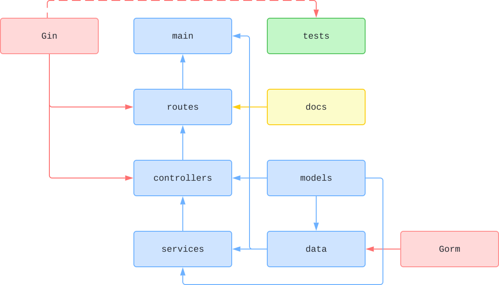

# 🧪 RESTful API with Go and Gin

[](https://github.com/nanotaboada/go-samples-gin-restful/actions/workflows/go.yml)
[](https://sonarcloud.io/summary/new_code?id=nanotaboada_go-samples-gin-restful)
[](https://app.codacy.com/gh/nanotaboada/go-samples-gin-restful/dashboard?utm_source=gh&utm_medium=referral&utm_content=&utm_campaign=Badge_grade)
[](https://codecov.io/gh/nanotaboada/go-samples-gin-restful)
[](https://goreportcard.com/report/github.com/nanotaboada/go-samples-gin-restful)
[](https://www.codefactor.io/repository/github/nanotaboada/go-samples-gin-restful)
[](https://opensource.org/licenses/MIT)

A proof-of-concept RESTful API built with [Go](https://go.dev/) and [Gin](https://gin-gonic.com/) demonstrating best practices for building production-ready web services with full CRUD operations, automated testing, and containerized deployment.

## Table of Contents

- [Features](#features)
- [Tech Stack](#tech-stack)
- [Architecture](#architecture)
- [Prerequisites](#prerequisites)
- [Getting Started](#getting-started)
  - [Local Development](#local-development)
  - [Docker Deployment](#docker-deployment)
- [Environment Variables](#environment-variables)
- [API Reference](#api-reference)
- [Testing](#testing)
- [Contributing](#contributing)
- [License](#license)

## Features

- 🔌 **RESTful API** with full CRUD operations for player management
- 📚 **Interactive API Documentation** with Swagger UI and Postman collection
- ⚡ **In-memory Caching** for improved performance (1-hour TTL)
- ✅ **Comprehensive Testing** with 80%+ code coverage requirements
- 🐳 **Docker Ready** with multi-stage builds and health checks
- 🔄 **CI/CD Pipeline** with automated testing and deployment
- 🏗️ **Layered Architecture** with clear separation of concerns
- 💾 **Pre-seeded Database** for immediate testing and exploration

## Tech Stack

| Category | Technology | Description |
|----------|------------|-------------|
| **Language** | [Go 1.24.1](https://go.dev/) | Primary programming language |
| **Web Framework** | [Gin](https://gin-gonic.com/) | High-performance HTTP web framework |
| **ORM** | [GORM](https://gorm.io/) | Developer-friendly ORM library |
| **Database** | SQLite | Lightweight embedded database |
| **API Documentation** | [Swagger/OpenAPI](https://swagger.io/) | Interactive API documentation via swaggo |
| **Caching** | [gin-contrib/cache](https://github.com/gin-contrib/cache) | In-memory caching middleware |
| **Testing** | [testify](https://github.com/stretchr/testify) | Assertion and mocking framework |
| **Containerization** | [Docker](https://www.docker.com/) & [Docker Compose](https://docs.docker.com/compose/) | Container platform and orchestration |

## Architecture



The application follows a **layered architecture pattern** with clear separation of concerns:

- **Route Layer** (`route/`) - URL routing and middleware configuration
- **Controller Layer** (`controller/`) - HTTP request/response handling and input validation
- **Service Layer** (`service/`) - Business logic and data operations
- **Data Layer** (`data/`) - Database connectivity and ORM configuration
- **Model Layer** (`model/`) - Data structures and entity definitions (shared across layers)

**Data Flow:** HTTP Request → Route → Controller → Service → Data/ORM → Database → Response

## Prerequisites

Before running this application, ensure you have:

- **Go 1.24.0 or higher** - [Download](https://go.dev/dl/)
- **Docker & Docker Compose** (optional, for containerized deployment) - [Download](https://docs.docker.com/get-docker/)
- **Git** - For cloning the repository

## Getting Started

### Local Development

1. **Clone the repository**

```bash
git clone https://github.com/nanotaboada/go-samples-gin-restful.git
cd go-samples-gin-restful
```

2. **Install dependencies**

```bash
go mod download
```

3. **Run the application**

```bash
go run .
```

The API will be available at `http://localhost:9000`

4. **Access Swagger documentation**

Open your browser and navigate to:

- **Swagger UI:** [http://localhost:9000/swagger/index.html](http://localhost:9000/swagger/index.html)
- **Health Check:** [http://localhost:9000/health](http://localhost:9000/health)

### Docker Deployment

This setup uses Docker Compose to build and run the app with a persistent SQLite database in a Docker volume.

1. **Build the Docker image**

```bash
docker compose build
```

2. **Start the application**

```bash
docker compose up
```

The API will be available at `http://localhost:9000`

> **Note:** On first run, the container initializes a pre-seeded SQLite database in a persistent volume. On subsequent runs, the existing data is preserved.

3. **Stop the application**

```bash
docker compose down
```

4. **Reset the database** (optional)

```bash
docker compose down -v
```

This removes the volume and reinitializes the database on the next startup.

### Environment Variables

| Variable | Description | Default |
|----------|-------------|---------|
| `STORAGE_PATH` | Path to SQLite database file | `./storage/players-sqlite3.db` |
| `GIN_MODE` | Gin framework mode (`debug`, `release`, `test`) | `debug` |

## API Reference

### Available Endpoints

| Method | Endpoint | Description |
|--------|----------|-------------|
| `GET` | `/health` | Health check endpoint |
| `GET` | `/players` | Retrieve all players |
| `GET` | `/players/:id` | Retrieve a player by ID |
| `GET` | `/players/squadnumber/:squadnumber` | Retrieve a player by squad number |
| `POST` | `/players` | Create a new player |
| `PUT` | `/players/:id` | Update an existing player |
| `DELETE` | `/players/:id` | Delete a player |

### Usage Examples

```bash
# Get all players
curl http://localhost:9000/players

# Get a specific player
curl http://localhost:9000/players/10

# Create a new player
curl -X POST http://localhost:9000/players \
  -H "Content-Type: application/json" \
  -d '{
    "id": 27,
    "firstName": "Paulo",
    "lastName": "Dybala",
    "squadNumber": 21,
    "position": "Forward",
    "team": "AS Roma"
  }'
```

### Swagger UI & Postman

**Interactive Documentation:** [http://localhost:9000/swagger/index.html](http://localhost:9000/swagger/index.html)

**Postman Collection:** [`postman-collections/go-samples-gin-restful.postman_collection.json`](postman-collections/go-samples-gin-restful.postman_collection.json)


The Swagger documentation is automatically generated from code annotations using [swaggo/swag](https://github.com/swaggo/swag). To regenerate after making changes:

```bash
swag init
```

## Testing

Run the test suite with coverage:

```bash
# Run all tests
go test ./...

# Run tests with coverage
go test -v ./... -coverprofile=coverage.out

# Run tests with detailed coverage for specific packages
go test -v ./... \
  -coverpkg=github.com/nanotaboada/go-samples-gin-restful/service,github.com/nanotaboada/go-samples-gin-restful/controller,github.com/nanotaboada/go-samples-gin-restful/route \
  -covermode=atomic \
  -coverprofile=coverage.out

# View coverage report
go tool cover -html=coverage.out
```

**Coverage targets:** 80% minimum for service, controller, and route packages.

## Contributing

Contributions are welcome! Please read our [Contributing Guidelines](CONTRIBUTING.md) before submitting pull requests.

- Follow [Conventional Commits](https://www.conventionalcommits.org/) for commit messages
- Ensure all tests pass and maintain code coverage above 80%
- Run `go fmt` before committing
- See [CODE_OF_CONDUCT.md](CODE_OF_CONDUCT.md) for community guidelines

## License

This project is licensed under the MIT License - see the [LICENSE](LICENSE) file for details.

---

**Note:** This is a proof-of-concept project intended for educational and demonstration purposes.
